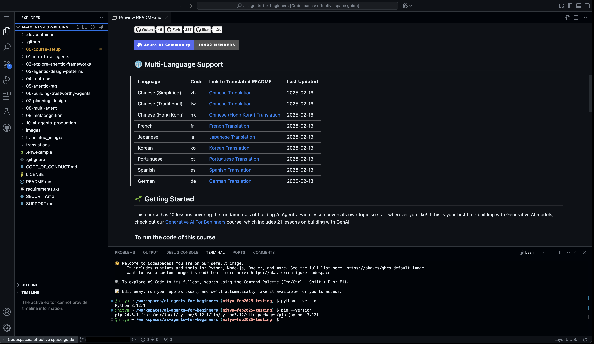

# Course Setup

## 1. Introduction

This lesson will cover how to run the code samples of this course.

## 2. Requirements

- A personal GitHub Account - [Sign up](https://github.com/signup) for a free account.
- An optional Azure Account - [Sign up](https://aka.ms/azure) for a free account.
- Python 3.12+ Runtime - for executing code samples.


## 3. Quickstart

To get started, you will need to complete these steps:

1. [Clone or Fork the Repo](#4-clone-or-fork-this-repo) - to get a personal copy to explore and extend.
2. [Setup dev environment](#5-setup-dev-environment) - install required packages or use dev container.
3. [Setup model environments](#6-setup-model-environments) - create accounts or projects as needed.
4. [Update your env variables](#7-update-your-environment-variables) - configure your dev environment to run code.

Let's walk through these, next.

<br/>

## 4. Clone or Fork this Repo

To begin, please clone or fork this GitHub Repository. This will make your own version of the course material so that you can run, test and extend the code samples to improve your intuition!

1. Click the [Fork](https://github.com/microsoft/ai-agents-for-beginners/fork) icon at the top of the repo to start the process. You should see something like this:

    

1. Select your GitHub profile name from the _Choose an owner_ dropdown menu, then click **Create fork** to complete the action. You should now be redirected to your fork of the repo and see something like this:

    


Congratulations! You now have a personal fork of the repo that you can modify and extend to build a better understanding of the materials.

<br/>

## 5. Setup Dev Environment

Viewing the lessons themselves requires just a Markdown-capable editor. For instance, you can view these files in the browser, or open your local clone in Visual Studio Code, to browse the lessons.

**Code Samples**: Running the code samples in a given lesson will require a _Python 3.12+_ runtime with the required package dependencies installed.

### 5.1 Option 1: Pre-built Container

The repository is configured with a [`.devcontainer`](https://containers.dev) that gives you a pre-defined dev enviroment with all tools and packages pre-installed. This is the _recommended_ approach for a fast start with minimal manual setup steps.

Activate the dev container by launching your fork in GitHub Codespaces (in the browser) or using Docker Desktop with VS Code (in your local device). Once launched you will get a Visual Studio Code editor (browser or local) that is connected remotely to that container, giving you a ready-to-go environment for code samples execution.



The screenshot above shows an example of the launched GitHub Codespaces on a personal fork of the repo. Note that the terminal is open, and shows the Python environment is already setup for use.


### 5.2 Option 2: Manual Setup

> **Note:** For manual setup, we recommend that use a virtual environment like `conda` or `venv` to reduce conflicts between Python projects.

Use this option if you want to run this in a Python environment _in your local device_. Check that your installed version of Python is 3.12 or higher, and that you have `pip` installed for package management.

```bash
# Check python installed
python --version

# Check pip installed
pip --version
```

Then install required dependencies using the command below from the root of your cloned repository on your device.

```bash
pip install -r requirements.txt
```


<br/>

## 6. Setup Model Environments

To build and test out various code samples, we will be making use of different AI model deployments when necessary. This section captures the various model provider setup and configuration requirements. **Note: You only need these to run the relevant code samples - and can consider them optional otherwise.**.

The code samples in this repository use one or more of these model providers:

1. [GitHub Models Marketplace](https://github.com/marketplace/models) - this gives you free access to a broad variety of Large Language Models (LLMs) using just your GitHub account identity. To use these models you will need to [Retrieve a GitHub Personal Access Token](#61-generate-a-github-personal-access-token-pat) as described below.

1. [Azure AI Foundry](https://learn.microsoft.com/azure/ai-services/agents/concepts/model-region-support) - this is used primarily for Azure AI Agent Service code samples and targets _pay-as-you-go_ model deployments for the subset of models it supports. To use these models you will need to create an Azure AI Foundry project and [Retrieve the Project Connection String](#62-retrieve-the-azure-ai-project-connection-string) for deployed models.


### 6.1 Generate A GitHub Personal Access Token (PAT)

Currently this course takes advantage of the GitHub Models Marketplace which offers free access to Large Language Models (LLMs) in rate-limited deployments that are perfect for learners. For instance, we will use the [gpt-4o-mini](https://github.com/marketplace/models/azure-openai/gpt-4o-mini/playground) model deployment in some of our code samples, for agent creation.

1. To authenticate with the model you will need to generate a personal access token (PAT) in your GitHub settings.
1. Click [this link](https://github.com/settings/tokens) in your GitHub account to visit the Developer settings page. Then click the **Generate new token** drop down and pick the _Fine-grained, repo-scoped_ option as shown below.
    
1. You will be taken to the following page. Fill in a _token name_ of your choice, scroll to the bottom of the page, and confirm creation.
    
1. You will now see the page update as shown below showing you the newly created personal access token. **IMPORTANT**: You must copy this token now for use in the next secton! You will not see this value again once you leave that page.
    

_Now move to th [Update environment variables](#7-update-your-environment-variables) section to complete configuration_.


### 6.2 Retrieve the Azure AI Project Connection String

This section is relevant if you plan on running code samples using the Azure AI Agent service.

1. To run the samples you need an Azure AI Foundry project with a deployed model.
1. Walk through [this quickstart](https://learn.microsoft.com/azure/ai-services/agents/quickstart?pivots=ai-foundry#create-a-hub-and-project-in-azure-ai-foundry-portal) to setup the base Azure AI project and hub resources. The creation dialog will take a few minutes to complete.

    

1. When complete, it will take you to the project overview page in the [Azure AI Foundry portal](https://ai.azure.com). You will see something like this:
    

1. Remember this page and note the places where it provides the values for your endpoint, api key, and connection string, for use in the [Update env vars](#7-update-your-environment-variables) section

1. Complete [this step to deploy models](https://learn.microsoft.com/azure/ai-services/agents/quickstart?pivots=ai-foundry#deploy-a-model) - and pick `gpt-4o-mini` for now.

You are now set for exploring Azure AI Agent service and other code samples that use the Azure AI Foundry portal and SDK!

> **IMPORTANT**: Deploying these services has a cost. When you are done with the exercises, don't forget to delete the resource group to stop usage and prevent unexpected costs later.

## 7. Update Your Environment Variables 

Once you completed setting up your model environments, you need to update the _local_ environment variables to access those deployments.

1. If not previously done, create the `.env` file using this command:

    ```bash
    cp .env.example .env
    ```
1. Open the created `.env` file in your editor. It will look like this. Every listed environment variable is used in _some_ code sample in this repository. Fill in values as you know them - you can always update them later.

    ```bash
    # Azure AI Foundry models
    GLOBAL_LLM_SERVICE="AzureOpenAI"
    AZURE_OPENAI_API_KEY=                    # "....."
    AZURE_OPENAI_ENDPOINT=                   # "https://.....openai.azure.com/"
    AZURE_OPENAI_EMBEDDING_DEPLOYMENT_NAME=  # "gpt-4o-mini"
    AZURE_OPENAI_API_VERSION=                # "2024-05-01-preview"
    PROJECT_CONNECTION_STRING=               # "eastus2.api.azureml.ms....."

    # GitHub Marketplace models
    GITHUB_TOKEN=          # "github_pat....."
    GITHUB_MODEL=          # "gpt-4o-mini"                            
    GITHUB_ENDPPOINT=      # "https://models.inference.ai.azure.com/"                     
    ```

1. **Update GitHub Variables:** - Copy the GitHub PAT Token from [this step](#61-generate-a-github-personal-access-token-pat) into the right-hand side of the `GITHUB_TOKEN=` line to replace that comment. Uncomment the values for model and endpoint to use those defaults. You can always update any of these later. You should now have something like this - where the token value is the full string you copied previously.

    ```bash
    GITHUB_TOKEN="github_pat....."
    GITHUB_MODEL="gpt-4o-mini"                            
    GITHUB_ENDPPOINT="https://models.inference.ai.azure.com/"      
    ```

1. **Update Azure AI Variables:** - Reference the screenshot in [the Azure setup](#62-retrieve-the-azure-ai-project-connection-string) section and copy the relevant values over to the `.env` file as below:

    ```bash
    # Azure AI Foundry models
    AZURE_OPENAI_API_KEY= #hidden value at top of screen
    AZURE_OPENAI_ENDPOINT= #value under the mustard bar
    AZURE_OPENAI_EMBEDDING_DEPLOYMENT_NAME="gpt-4o-mini"
    AZURE_OPENAI_API_VERSION="2024-05-01-preview"                
    PROJECT_CONNECTION_STRING= #Value under the orange bar
    ```
    
You should now be set to run Azure AI based samples!


## 8. Run The Code Samples!

You are now ready to run the code samples! Note that many samples are in the form of Jupyter Notebooks where running the samples is typically requires these steps:

1. Open the notebook file in VS Code
1. Click the "Select Kernel" (top right) and pick the default Python environment (3.12+)
1. Make sure you "Clear outputs" to remove any traces from previous runs
1. Make sure you "Restart kernel" if you changed env variables, to get the latest values.

_If you run into issues where the code seems to be picking up the wrong environment values or complains about missing values, simply restart the kernel and try again_.

## 9. Troubleshooting Help

If you have any issue running this setup, or have questions about the content, 
- hop into our [Azure AI Community Discord](https://discord.gg/kzRShWzttr){target="_blank"} 
- or [create an issue](https://github.com/microsoft/ai-agents-for-beginners/issues?WT.mc_id=academic-105485-koreyst){target="_blank"} in our repository

Happy learning more about the world of AI Agents!
